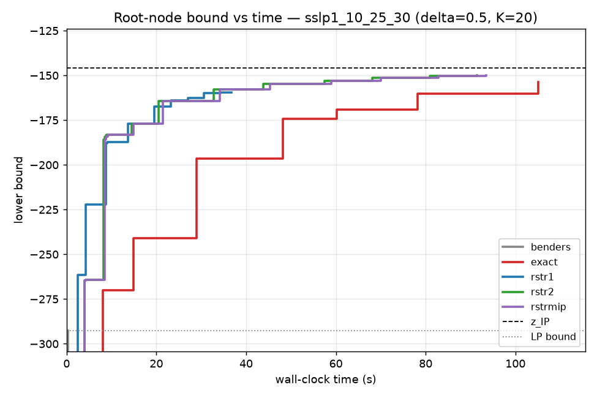

# Lagrangian Cuts for Two-Stage Stochastic Integer Programs

A from-scratch reproduction of

> Rui Chen and James Luedtke, *On Generating Lagrangian Cuts for Two-Stage
> Stochastic Integer Programs*, arXiv:2106.04023v2 (2022).

together with a research scaffold for extending the paper's **restricted
separation** idea along two general, method-level axes (see
[Research roadmap](#research-roadmap)).

The implementation uses the open-source [HiGHS](https://highs.dev) solver
(`highspy`) for every LP and MIP, so it runs without a commercial license.

## What is reproduced

The paper accelerates the generation of Lagrangian cuts for the Benders
reformulation of a two-stage SIP. A Lagrangian cut (eq. 13) is

```
pi @ x + pi0 * theta_s  >=  Q*_s(pi, pi0),
    Q*_s(pi, pi0) = min { pi @ x + pi0 (q_s @ y) : (x, y) in K_s }
```

and separating a point means maximising the violation over a coefficient set
`Pi_s`. The core contribution is to search `pi` in a **low-dimensional
subspace** (the span of recent Benders-cut coefficients) instead of the full
cone, which makes each separation cheap.

Implemented cut generators (`method=` in `lagcuts.algo2.Config`):

| method    | `Pi_s`                                             | paper |
|-----------|----------------------------------------------------|-------|
| `benders` | Benders cuts only (LP-relaxation bound)            | §2.1  |
| `exact`   | full normalised cone `alpha*pi0 + ‖pi‖₁ ≤ 1`       | eq. 17 |
| `rstr1`   | `pi = Σ βₖ πᵏ`, `alpha*pi0 + ‖pi‖₁ ≤ 1`            | eq. 19 |
| `rstr2`   | `pi = Σ βₖ πᵏ`, `alpha*pi0 + ‖β‖₁ ≤ 1`             | eq. 20 |
| `rstrmip` | eq. 20 with the basis chosen by the MIP (eq. 28)   | §4.3  |

Algorithm 1 (restricted separation, `separation.py`), Algorithm 2 (root-node
cut loop, `algo2.py`), the upper-bounding model `Qbar*_s` (eq. 18), the small
`pi0` safeguard (§5.1) and the perfect-information pool initialisation (§4.2)
are all in place.

Validated relationships (see `tests/`): `z_LP ≤ z_restricted ≤ z_LC(exact) ≤
z_IP`, and `z_LC = z_D` (Theorem 3) — exact separation closes the whole
Lagrangian-dual gap on small instances.

### Reproduced result

Root-node lower bound vs wall-clock time on an SSLP instance
(`m=10, n=25, S=30`, `delta=0.5`, `K=20`):



The restricted variants `rstr2`/`rstrmip` reach the Lagrangian-dual bound
quickest, `rstr1` plateaus slightly lower (its basis is limited to the last `K`
Benders coefficients), and **exact** separation is far slower — it has not
converged at the time limit — reproducing the paper's central finding that
restricted separation improves the bound much faster than exact separation. The
Benders-only LP bound (dotted) sits far below, showing the integrality gap that
Lagrangian cuts close. Numbers for this run:

| method  | final LB | gap closed | oracle (MIP) calls |
|---------|---------:|-----------:|-------------------:|
| benders | −292.5   |       0 %  |          0 |
| exact   | −153.9   |    97.2 %  |       2019 |
| rstr1   | −159.4   |    93.2 %  |        454 |
| rstr2   | −149.8   |     100 %  |        800 |
| rstrmip | −149.8   |     100 %  |        800 |

## Layout

```
src/lagcuts/
  sslp.py         SSLP instance generator (paper appendix recipe)
  oracle.py       Q_s(x), Benders LP dual cut, Q*_s(pi,pi0) single-scenario MIP
  separation.py   Algorithm 1: restricted separation + Pi_s + pool Ehat_s
  rstrmip.py      RstrMIP basis-selection MIP (eq. 28)
  master.py       Benders master (root-node LP relaxation), dynamic cuts
  algo2.py        Algorithm 2 loop, lower-bound-vs-time logging
  reference.py    extensive-form z_IP for validation
experiments/      gap-closed / bound-over-time drivers
tests/            theoretical-ordering validation
```

## Running

```bash
pip install -r requirements.txt
PYTHONPATH=src python -m pytest tests -q          # validation
PYTHONPATH=src python experiments/run_rootnode.py # bound-over-time comparison
```

## Research roadmap

The reproduction is the baseline for two extensions framed as *general
techniques* (verified on SIP, but stated on a broader axis):

- **A — Adaptive low-dimensional coefficient subspaces.** Treat the separation
  subspace as an *online-maintained generating set* driven by the low-rank
  structure of the optimal-coefficient sequence, rather than a fixed span of
  Benders coefficients, with a cut-strength-loss vs subspace-approximation
  bound. Generalises "restricted separation" to any cutting-plane method whose
  separation is an expensive-oracle convex program.
- **C — Amortised / learned separation across scenarios.** Exploit the scenario
  population to learn a shared policy that predicts a good subspace (or `pi`)
  directly, amortising the per-scenario separation cost. Nests naturally inside
  axis A.

These are scaffolding targets; the code above is the faithful baseline they
build on.
